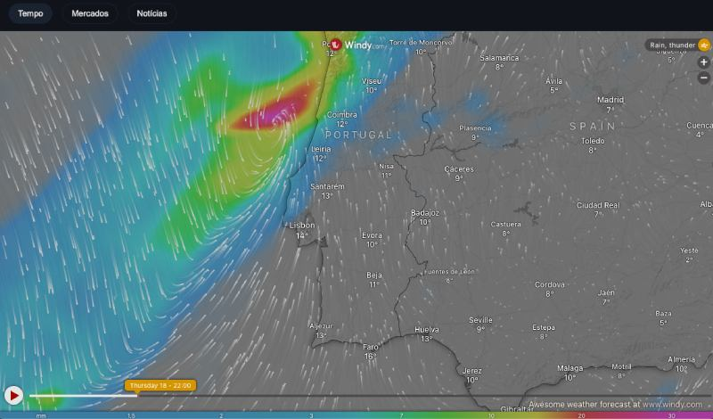
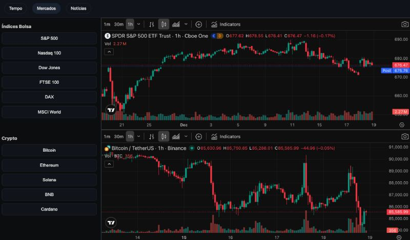

# Daily Dashboard  
### Weather · Markets · News — Built for always-on screens

A **minimalist, zero-backend web dashboard** designed for **kiosk mode**, optimized for **Raspberry Pi** and **dedicated displays** (TVs, wall screens, family hubs).

Built to answer a simple question:

> **What information do I actually want to see, at a glance, every day?**

Tested on **Raspberry Pi 3**, running at **Full HD (1920×1080)**, but works on **any modern browser, any OS**.

No servers.  
No accounts.  
No API keys.  
No tracking.  

Just **useful information, always visible**.

---

## Screenshots

### Weather


### Markets


---

## Why this exists

This project was built as a **personal daily dashboard** for home use — a screen that stays on and shows:
- Weather at a glance
- Market movements
- Relevant news

Over time, it became a **clean, reusable solution**, built with the help of AI to accelerate development across stacks I don’t normally use (HTML, CSS, JavaScript).

This repository reflects:
- Practical engineering
- Simplicity over complexity
- Public data over private APIs
- Control over convenience

---

## Pages Overview

### Weather
- Interactive **Windy** weather map
- Fullscreen layout
- Designed for continuous display

### Markets
A **2×2 grid layout**:
- Stock market indices (ETF equivalents)
- Interactive TradingView chart
- Cryptocurrency list
- Interactive TradingView chart

Charts update **on click**, without page reloads.

### News
- International news (BBC)
- National news (Expresso)
- RSS feeds rendered client-side
- Dark theme, optimized for long-distance readability

---

## Navigation
- Top tabs: **Weather / Markets / News**
- Mouse and touch friendly
- Ideal for:
  - Dedicated wall screens
  - TVs
  - Raspberry Pi kiosks
  - Family or office dashboards

---

## Tech Stack & Design Choices

- **HTML5**
- **CSS Grid**
- **Vanilla JavaScript**
- Chromium (kiosk mode)
- Windy embed
- TradingView embeds
- Public RSS feeds

No frameworks by design.  
Zero backend.  
Zero maintenance.

---

## Requirements

- Raspberry Pi 3 or newer  
- Raspberry Pi OS (Bullseye / Bookworm / Trixie)
- Chromium browser  
- Screen resolution: **1920×1080**
- Mac, Windows compatible

---

## Kiosk Mode (Example)

```bash
chromium \
  --kiosk \
  --incognito \
  --disable-infobars \
  --noerrdialogs \
  --password-store=basic \
  --use-mock-keychain \
  --force-device-scale-factor=1.2 \
  file:///home/$HOME/dashboard.html
  ```

  ---

  ## Autostart

  - Create an autostart folder inside ~/.config
  - Copy dashboard_v2.html
  - Chromium will launch automatically in kiosk mode
  - To exit: Alt + F4

  ---

  ## Customization

  - Weather Location (Windy)
  - Edit latitude and longitude in the Windy iframe inside dashboard_v2.html:

```bash
<iframe
  src="https://embed.windy.com/embed2.html?lat=38.7223&lon=-9.1393&zoom=7&overlay=rain&product=ecmwf&metricTemp=%C2%B0C">
</iframe>
```

  ---

  ## Time & Date Locale

  The clock uses browser locale and system time.

```bash
now.toLocaleTimeString('pt-PT', { ... })
now.toLocaleDateString('pt-PT', { ... })
```

  Change 'pt-PT' to:
  - 'en-GB'
  - 'en-US'
  - 'de-DE'
  - 'fr-FR'
  - etc.

  ---

  ## License

  This project is licensed under the
  Creative Commons Attribution–NonCommercial 4.0 International (CC BY-NC 4.0).

  You are free to:
  Share — copy and redistribute the material
  Adapt — remix, transform, and build upon the material
  Under the following terms:
  Attribution — you must give appropriate credit
  NonCommercial — you may not use the material for commercial purposes

  License details:
  https://creativecommons.org/licenses/by-nc/4.0/